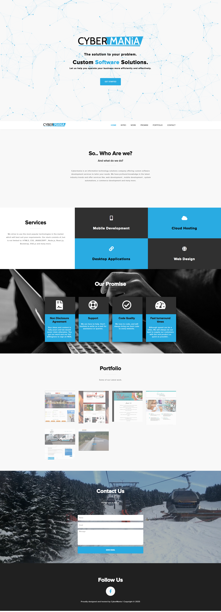

# 🚀 Cybermania Website

> One Pager portfolio Website

[](LICENSE)
[]()

---

## 📸 Demo / Screenshots

<p align="center">
  
</p>

---

## 📜 About

One Pager website with php contact form used as a portfolio website

---

## 🛠 Tech Stack

**Frontend:** HTML, CSS, javascript, PHP
**Backend:** None
**Database:** None

---

## ⚙️ Installation

```bash
# Clone the repo
git clone https://github.com/Daneelv/Cybermania-Website.git

# Run locally
run with live server on vs code
```
